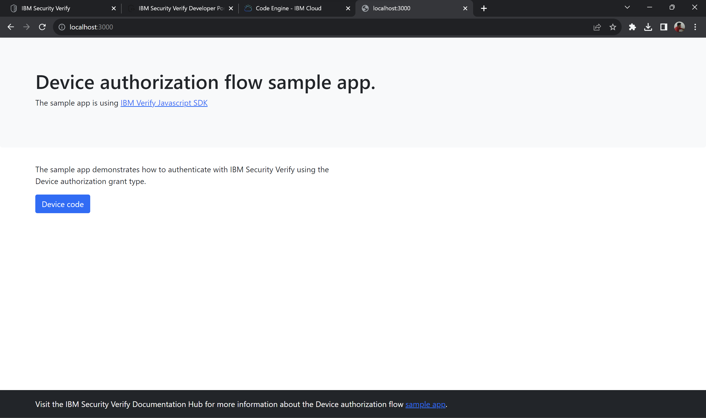
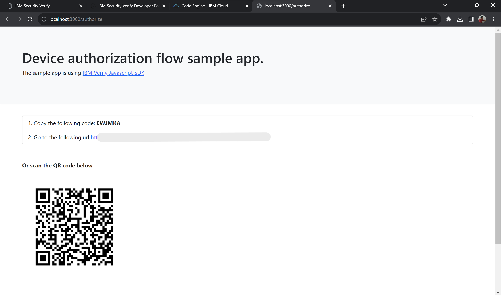
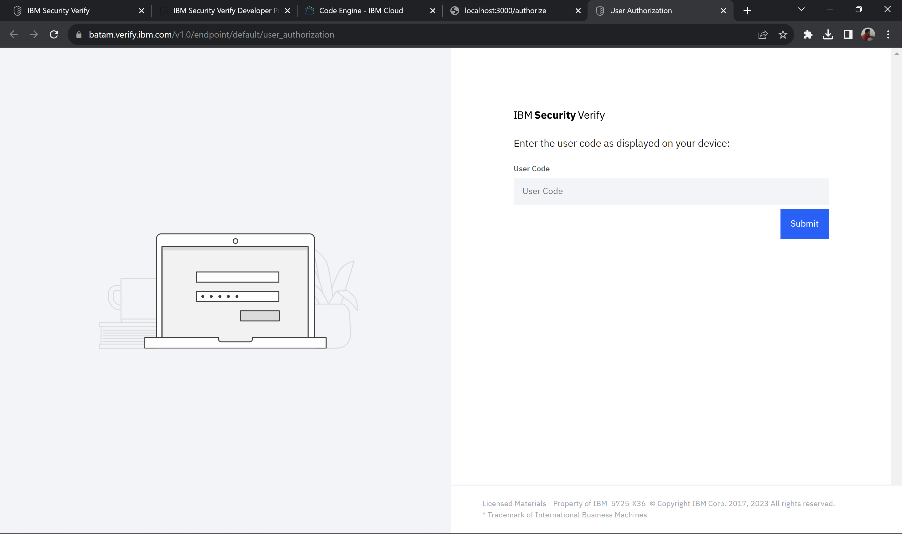
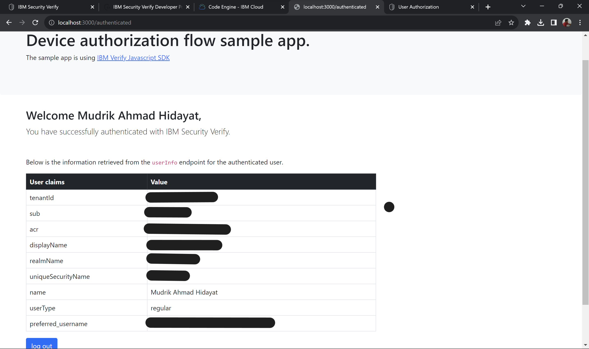
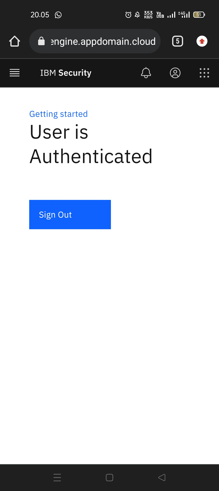

# 🔐 IBM Security Verify - Secure Login Demo

**Project:** Secure Authentication System Implementation
**Role:** System Integrator
**Tools:** IBM Security Verify, Node.js App
**Feature:** QR Code Login / Multi-Device Verification

## 📝 Project Summary
Repository ini adalah dokumentasi implementasi sistem login aman yang terintegrasi dengan **IBM Security Verify**.

Dalam project ini, saya mengonfigurasi fitur **"Passwordless Login"**, di mana user tidak perlu mengetik password yang rentan dicuri, melainkan melakukan verifikasi menggunakan perangkat kedua (Smartphone) via QR Code.

Sistem ini mensimulasikan standar keamanan Enterprise untuk memitigasi risiko *unauthorized access*.

## 🚀 Live Workflow (Alur Sistem)
Berikut adalah dokumentasi alur login yang berhasil saya konfigurasi dan jalankan:

### Step 1: Initialization
User mengakses aplikasi RentCar. Aplikasi meminta otentikasi aman sebelum memberikan akses.

### Step 2: Security Challenge (QR Code)
Sistem men-generate **QR Code** dan **User Code** unik. User diminta melakukan verifikasi di perangkat terpercaya (HP).

### Step 3: Device Verification
User memasukkan kode unik pada portal keamanan **IBM Security Verify** untuk konfirmasi identitas.

### Step 4: Authentication Success (Desktop & Mobile)
Sistem memvalidasi identitas secara real-time. Dashboard menampilkan detail **User Claims** (Tenant ID, Realm Name) yang ditarik langsung dari server IBM.

**Tampilan Web Dashboard (Data User):**

**Tampilan Verifikasi Sukses di HP:**

---
*Note: Project ini mendemonstrasikan kemampuan integrasi sistem keamanan (IAM) dan troubleshooting alur verifikasi user.*
